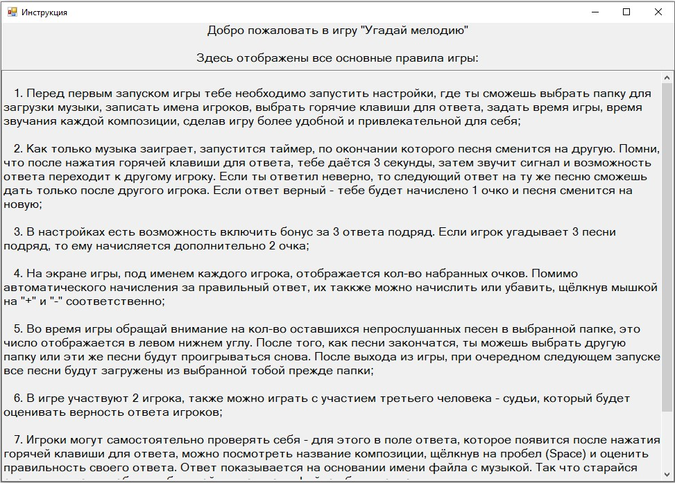
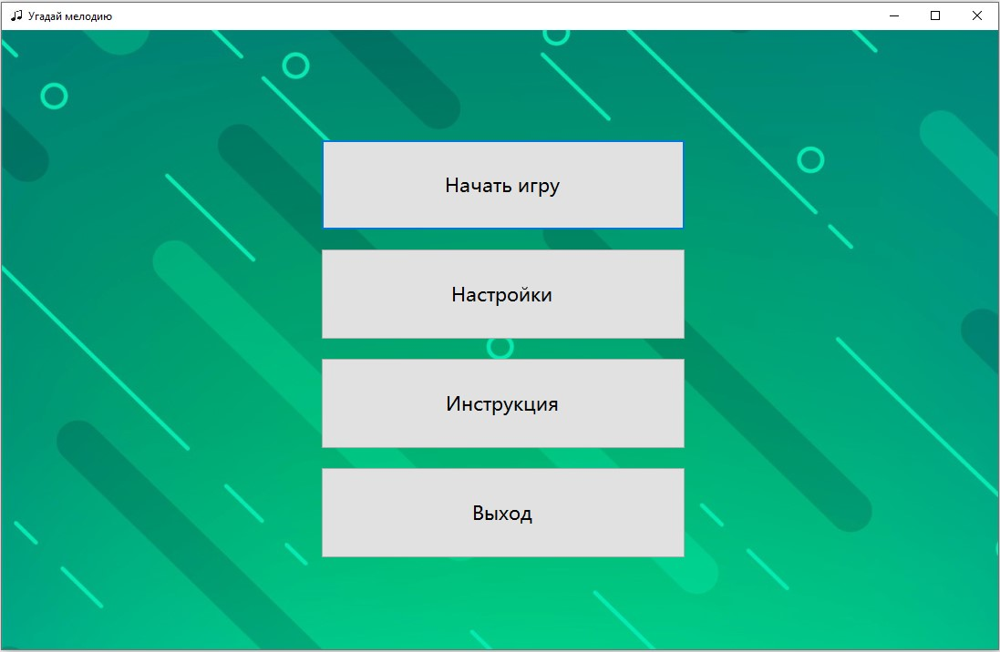
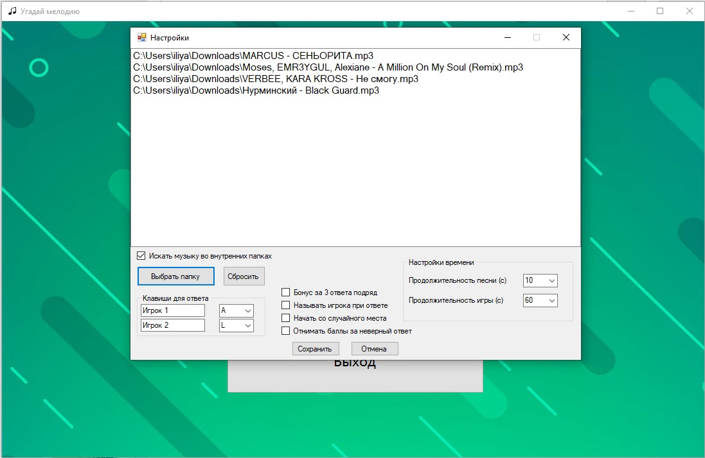
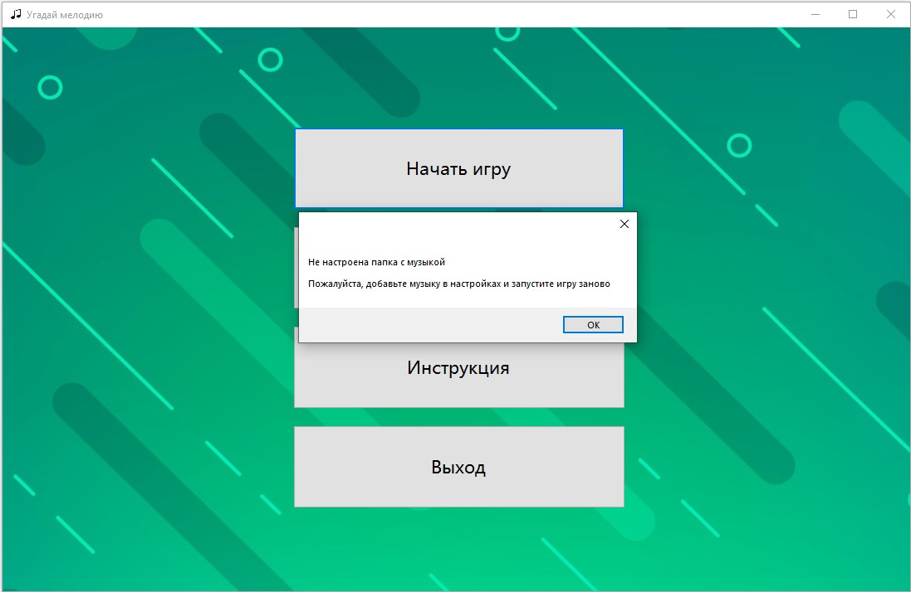
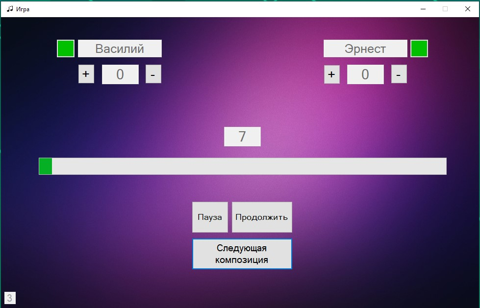
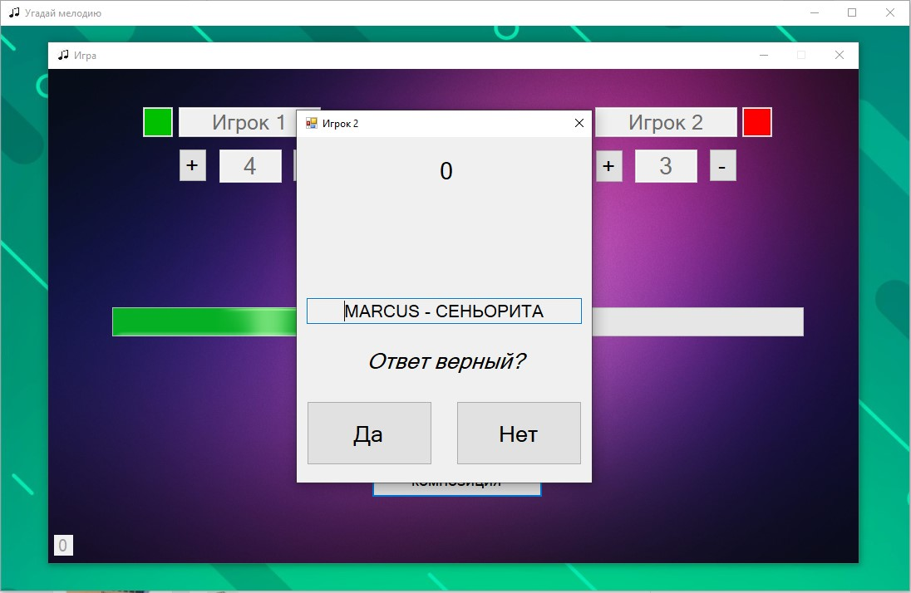
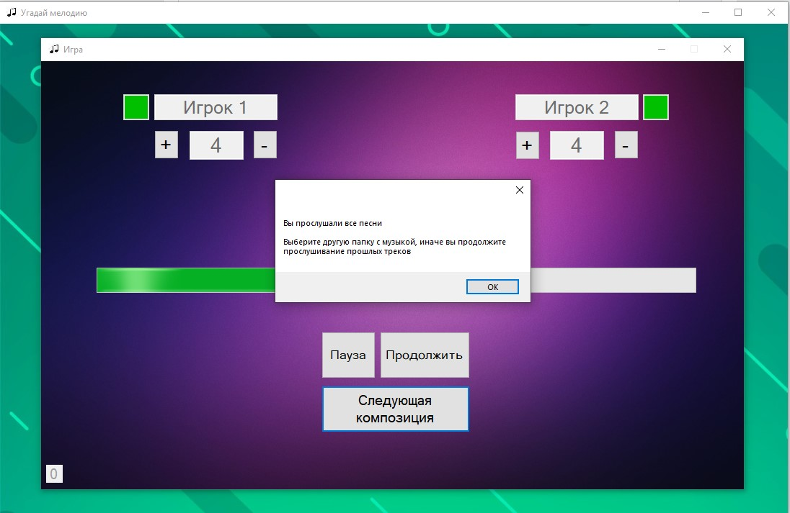

# GuessMelody
Данное приложение представляет собой интерактивную игру "Угадай мелодию" для двоих человек. Цель - набрать наибольшее количество очков к концу игры. Очки начисляются игрокам за верно угаданную композицию. С помощью настроек приложения можно разнообразить игровой процесс включением/выключение различных встроенных механик игры.

Целевая платформа - .Net Framework 4.6.1

Приложение имеет графический пользовательский интерфейс, реализованный с использованием Windows Forms

## Описание работы приложения
При первом запуске приложения на экране появится окно с инструкцией, где игроки могут ознакомиться со всеми правилами и возможностями игры. 

После закрытия инструкции на экране появится главное окно приложения. Там пользователь при необходимости может ещё раз ознакомиться с инструкцией, открыть настройки игры, запустить игру.

При первом запуске приложения пользователю необходимо будет запустить настройки, где ему будет необходимо указать папку с музыкой для дальнейшей игры, а также настроить игру максимально удобно для себя и своего соперника

После нажатия кнопки "Сохранить" все настройки сохраняются в реестр - вам не нужно будет каждый раз настраивать приложение заново.

Если при первом запуске пользователь не настроил папку для музыки, а вместо этого решил сразу запустить игру, то он получит ошибку. Игра не запустится, пока пользователь не выберет музыку.

Когда пользователь всё-таки настроит игру согласно инструкции и запустит её, то на экране появится новое окно, где будут отображаться имена игроков (их можно также изменить в настройках), количество очков рядом с их именами, индикатор доступности ответа (на картинке ниже горит зелёным цветом) - не допускает возможности ответа одного игрока более 1 раза подряд при неверном ответе (для удобства игроков реализовано светофором, при невозможности ответа загорается красным), также кнопки "+" и "-" около количества очков каждого игрока для их ручного изменения, ниже указано время в секундах до конца ответа по текущей мелодии, ещё ниже - индикатор длительности игры - изображает время до конца игры. Также ниже можно увидеть кнопки с возможность приостановить игру, продолжить и включить следующую композицию, если ни один из игроков не может угадать текущую. В левом нижнем угла отображается количество непрослушанных песен. С проигрыванием очередной композиции этот счётчик уменьшается.

В процессе игры, если какой-то игрок хочет ответить, то ему следует нажать на настроенную для себя горячую клавишу ответа, тогда появляется окно для ответа с таймером, чтобы игрок особо не затягивал. Также возле имени отвечающего игрока загорится красный свет. После того, как он ответил, его можно проверить, нажав на "Space" (пробел), чтобы показать верный ответ

И далее необходимо выбрать верно ли ответил игрок или нет. Если игрок ответил верно, то ему будут автоматически начислены очки за верный ответ, иначе, в зависимости от настроек игры, игроку может ничего не начислиться или у него могут сгореть очки за неверный ответ. Данная возможность игры позволяет играть в неё двум игрокам без судьи. Однако, в игру можно подключить третьего человека, который рассудит игроков при их ответе и сам будет начислять игрокам очки.

После того, как игроки прослушают все выбранные в настройках композиции, на экран выведется сообщение об этом. Далее вы можете выбрать другую папку с музыкой в настройках или же слушать эти же композиции повторно

Если здесь я упустил какие-то детали, то подробно со всеми возможностями и правилами игры вы можете ознакомиться в инструкции приложения.
## Установка приложения
Чтобы установить приложение - запустите установочный файл "ForInstallation/setup.exe" и дождитесь окончания установки. После этого на рабочем столе появится ярлык "GuessMelody" для запуска приложения.
